# Products API — Node + Express + MongoDB

This project uses the same development-container style and product data structure from the `mongodb-activities-s26` repo:

```js
{ name: "Laptop", price: 899.99, quantity: 10, warehouse: "A" }
```

The database connection is configured through `.env`:

```bash
MONGODB_URI=mongodb://db:27017
DB_NAME=storeDB
COLLECTION_NAME=products
PORT=3000
```

## Run in VS Code Dev Containers

1. Open this folder in VS Code.
2. Choose **Reopen in Container**.
3. After the container finishes building, run:

```bash
npm run seed
npm run dev
```

Open:

```text
http://localhost:3000
```

## API Routes

| Method | Route | Description |
|---|---|---|
| GET | `/api/health` | Check API and database connection |
| GET | `/api/products` | List all products |
| GET | `/api/products?warehouse=A` | Filter by warehouse |
| GET | `/api/products?minPrice=50&maxPrice=200` | Filter by price range |
| GET | `/api/products/:id` | Get one product |
| POST | `/api/products` | Create a product |
| PUT | `/api/products/:id` | Replace a product |
| PATCH | `/api/products/:id` | Partially update a product |
| DELETE | `/api/products/:id` | Delete a product |

## Example POST

```bash
curl -X POST http://localhost:3000/api/products \
  -H "Content-Type: application/json" \
  -d '{"name":"Docking Station","price":149.99,"quantity":20,"warehouse":"A"}'
```

## Example Queries

```bash
curl http://localhost:3000/api/products
curl "http://localhost:3000/api/products?warehouse=A"
curl "http://localhost:3000/api/products?minPrice=50&maxPrice=200"
curl "http://localhost:3000/api/products?maxQuantity=25"
```

## Questions
1. What is the purpose of using `.env`
The purpose of using a `.env` file is to store configuration values and environment variables separately from the main application code. In this project, the `.env` file stores the MongoDB connection string, database name, collection name, and port number. This makes the application more secure, easier to configure, and easier to move between different environments like development and production without changing the source code. Instead of hardcoding sensitive or changeable values directly into the application, the program reads them using `process.env`.
2. How does this work:
```js
if (query.minPrice || query.maxPrice) {
    filter.price = {};
    if (query.minPrice) filter.price.$gte = Number(query.minPrice);
    if (query.maxPrice) filter.price.$lte = Number(query.maxPrice);
}
```
This code creates a dynamic MongoDB filter for product prices based on query parameters from the URL. If the user provides a `minPrice` or `maxPrice`, the program creates a `price` filter object and uses MongoDB operators like `$gte` (greater than or equal to) and `$lte` (less than or equal to) to limit the results. For example, if the request is `/api/products?minPrice=50&maxPrice=200`, the API will only return products priced between 50 and 200. The `Number()` function converts the query string values into numbers before they are used in the database query.
3. What is the program `seed.js` used for?
The `seed.js` file is used to populate the MongoDB database with sample product data for testing and development. It connects to the database, removes any existing products using `deleteMany({})`, and then inserts the products from `products.js` using `insertMany()`. This makes it easy to reset the database to a clean state whenever needed. Running `npm run seed` quickly reloads all the test products into the database so the API can be tested consistently.
4. Try all API routes using Postman
## GET /api/health
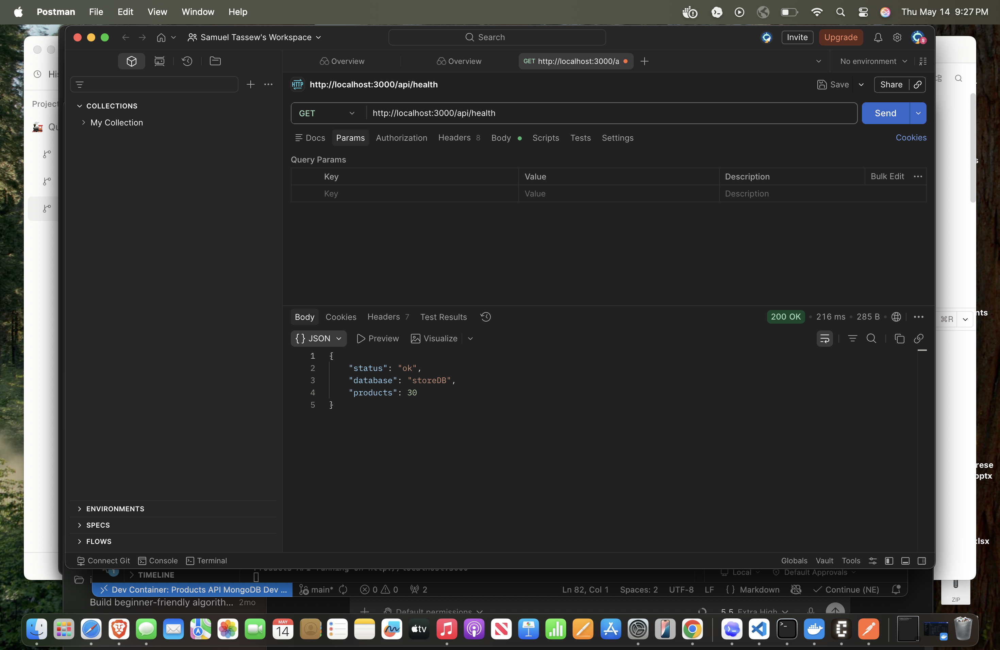


## GET /api/products
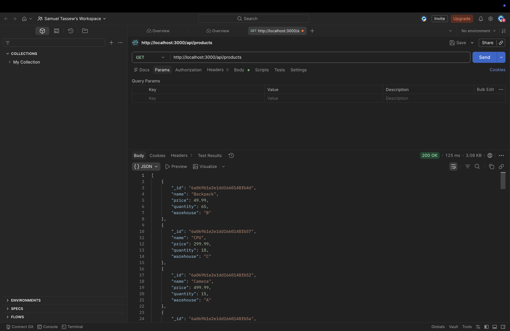


## GET /api/products?warehouse=A
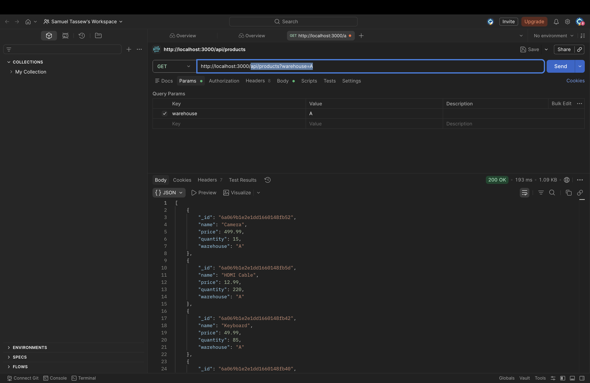


## GET /api/products?minPrice=50&maxPrice=200
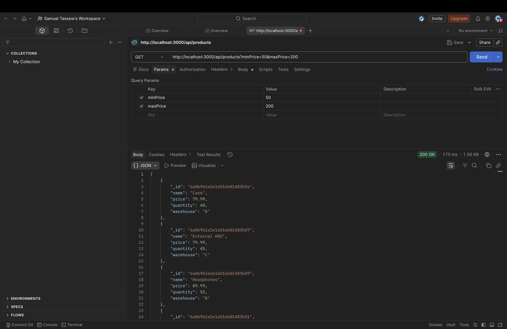


## GET /api/products?minQuantity=20&maxQuantity=100
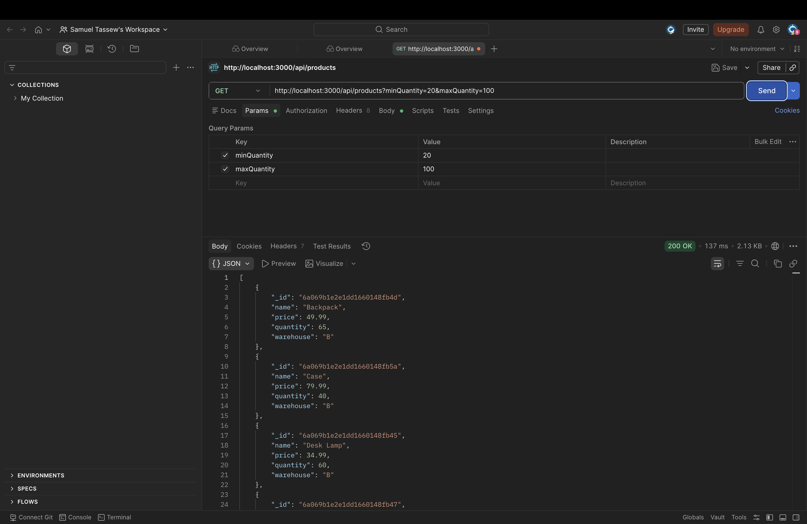


## GET /api/products?name=laptop
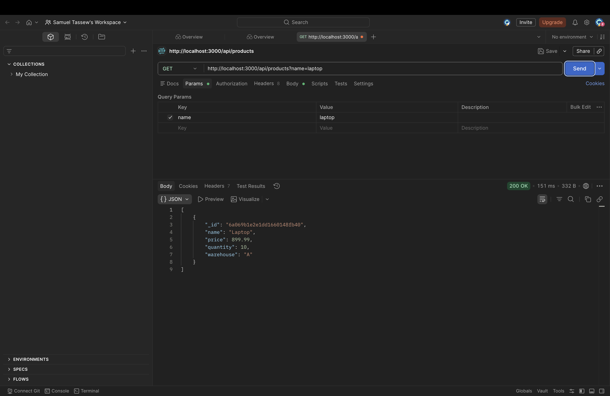


## GET /api/products/:id
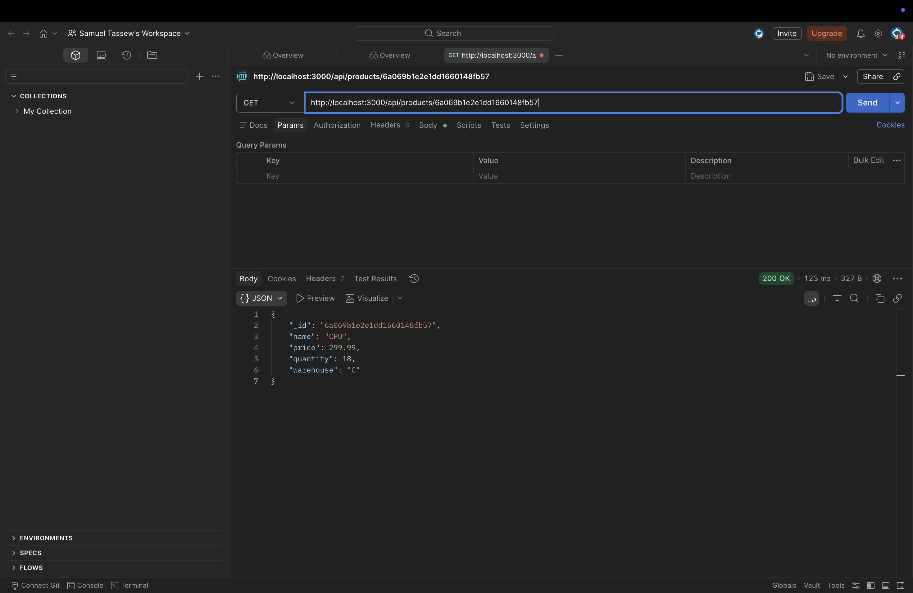


## POST /api/products
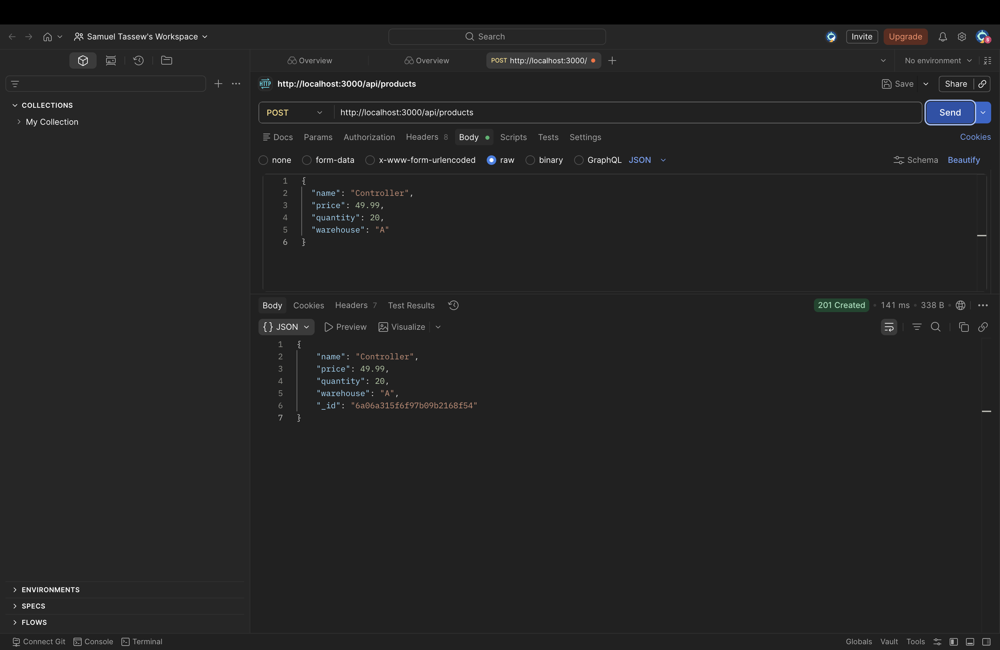


## PUT /api/products/:id
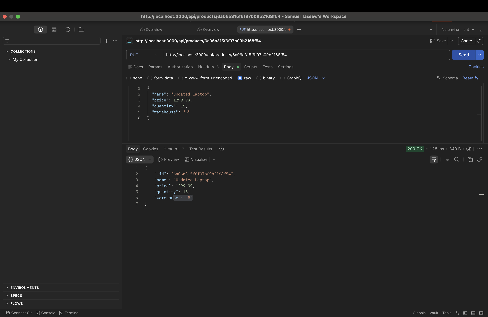


## PATCH /api/products/:id
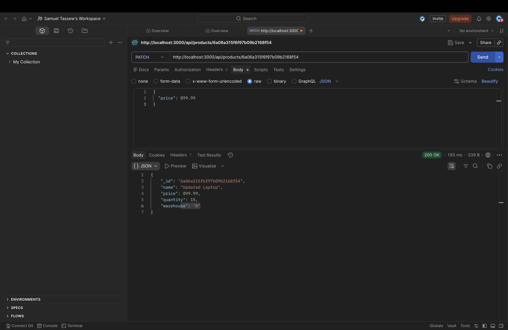


## DELETE /api/products/:id
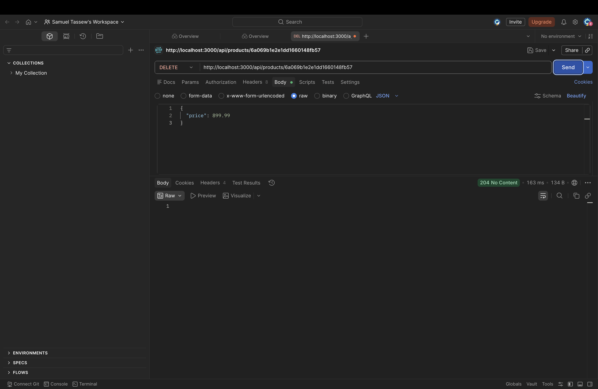


5. In terms of code what is the difference between `put` and `patch`
The difference between `PUT` and `PATCH` is that `PUT` replaces the entire object while `PATCH` only updates specific fields. In this project, the `PUT` route expects all product fields such as `name`, `price`, `quantity`, and `warehouse`, and it replaces the existing product data completely. The `PATCH` route is more flexible because it only updates the fields included in the request body. For example, `PATCH` can update only the product price without changing the other fields.

## Exercise
Do a repo of your own to represent whatever you want as long as it has four fields (data members), make sure that your program has the "same" API routes and to provide test data. The README file should have screenshots of using all API routes, either by using Postman, or by modifying `index.html` to have all the operations. Also, add the answers to the questions on your README.

If you don't want to think about the object, you can do books: name, author, year, price.

